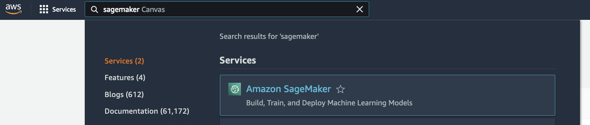

# Sentiment Analysis using BlazingText algorithm

>This lab is provided as part of **[AWS Innovate Machine Learning Edition](https://aws.amazon.com/events/aws-innovate/machine-learning/)**, click [here](https://github.com/roshansthomas/aws-innovate-ai-ml-2022) to explore the full list of hands-on labs
:information_source:
 You will run this lab in your own AWS account. Please follow directions
 at the end of the lab to remove resources to avoid future costs.

 ## Content
 1. [Introduction](https://github.com/roshansthomas/sm-sentimentanalysis-bt#introduction)
 2. [Sentiment Analysis](https://github.com/roshansthomas/sm-sentimentanalysis-bt#sentiment-analysis)
 3. [SageMaker Studio](https://github.com/roshansthomas/sm-sentimentanalysis-bt#sagemaker-studio)
 4. [Setup](https://github.com/roshansthomas/sm-sentimentanalysis-bt#setup)
 5. [SageMaker Studio UI Overview](https://github.com/roshansthomas/sm-sentimentanalysis-bt#sagemaker-studio-ui-overview)
 6. [JupyterLab Notebook](https://github.com/roshansthomas/sm-sentimentanalysis-bt#jupyterlab-notebook)
 7. [Cleanup](https://github.com/roshansthomas/sm-sentimentanalysis-bt#cleanup)
 
### Introduction

Amazon SageMaker is a fully managed service that removes the heavy lifting from each step of the machine learning workflow, and provides every developer and data scientist with the ability to build, train, and deploy machine learning (ML) models quickly.
The Amazon SageMaker BlazingText algorithm provides highly optimized implementations of the Word2vec and text classification algorithms. The Word2vec algorithm is useful for many downstream natural language processing (NLP) tasks, such as sentiment analysis, named entity recognition, machine translation, etc. Text classification is an important task for applications that perform web searches, information retrieval, ranking, and document classification.
Learn more about Amazon BlazingText algorithm [here](https://docs.aws.amazon.com/sagemaker/latest/dg/blazingtext.html).

### Sentiment Analysis
Sentiment Analysis is an application of NLP. Teaching a machine to analyse a sentiment is a classification problem. 
Here the ML model undergoes a supervised learning where the input data has features that teach the model to predict the label(e.g. Positive, Negative, Neutral).

There are various use cases of Sentiment Analysis wherein businesses can gather the public sentiment on a product that was released recently.

###  SageMaker Studio
In this lab, we will be using the SageMaker Studio. Amazon SageMaker Studio provides a single, web-based visual interface where you can perform all ML development steps. SageMaker Studio gives you complete access, control, and visibility into each step required to build, train, and deploy models.

All ML development activities including notebooks, experiment management, automatic model creation, debugging, and model and data drift detection can be performed within SageMaker Studio.

To know more. See [here](https://docs.aws.amazon.com/sagemaker/latest/dg/studio.html).

###  Setup

1. Navigate to the Amazon SageMaker service in the AWS console.
    
2. The SageMaker console is displayed as below. Click on the SageMaker Studio button. Before using the SageMaker studio, we will first need a SageMaker Domain. If you have a SageMaker Domain created already, you could use the same. Else a SageMaker domain will have to be created.
    
3. To create a new SageMaker Domain enter a Name in the **User Profile** section and then **Create a new role**.
    
4. For this lab, we will allow the new execution role access to **Any S3 bucket**. Once selected, click on Create Role.
    
5. Once back on the **Create Domain** page, Click on **Submit** button to create the Domain. The domain creation takes a few minutes.
    
6. Once the domain is created, Click on the **Launch app** lookup and Studio to Launch the SageMaker Studio. This takes a couple of minutes before the IDE is launched.
    

### SageMaker Studio UI Overview

The SageMaker Studio UI has a few sections. To explore further, click on the below links:
* [Left Sidebar](https://docs.aws.amazon.com/sagemaker/latest/dg/studio-ui.html#studio-ui-nav-bar)
* [File and resource browser](https://docs.aws.amazon.com/sagemaker/latest/dg/studio-ui.html#studio-ui-browser)
* [Main work area](https://docs.aws.amazon.com/sagemaker/latest/dg/studio-ui.html#studio-ui-work)
* [Settings](https://docs.aws.amazon.com/sagemaker/latest/dg/studio-ui.html#studio-ui-prefs)

### JupyterLab Notebook

1. On SageMaker Studio, click on **Git** option on the **Left Sidebar**. Then click on the **Clone a Repository**.
    
2. Enter the git repo URL as ``https://github.com/roshansthomas/sm-sentimentanalysis-bt.git`` and Click on **Clone**.
3. Click on the **File Browser** option on the **Left Sidebar**. Open the ``sentiment-analysis-blazingText.ipynb`` at the location ``sm-sentimentanalysis-bt/notebook``.
    
4. Run all cells as per instructions in the notebook.

### Cleanup

### Survey
Please help us to provide your feedback here. Participants who complete the surveys from AWS Innovate - AI ML Edition will receive a gift code for USD25 in AWS credits. AWS credits will be sent via email by dd Month yyyy.

